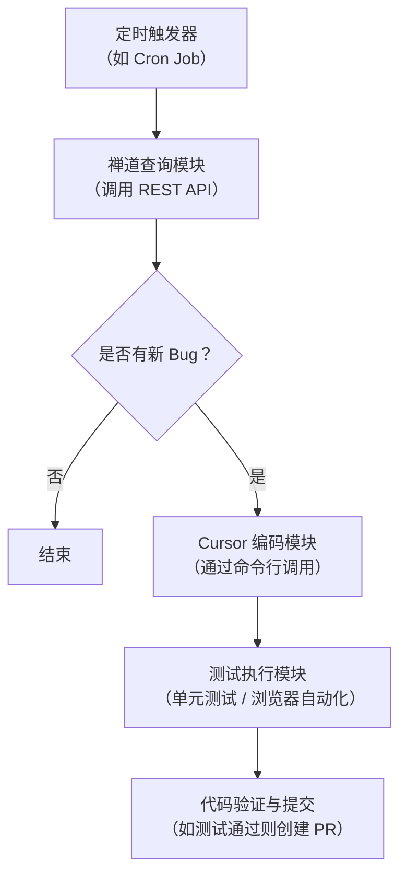

这是一个很有野心的自动化设想，相当于是要构建一个**AI驱动的Bug自动修复流水线**。这个想法完全可行，而且已经有像NVIDIA这样的大型团队在用Cursor实现类似的自动化工作流了。

落地这个Agent，关键在于**模块化设计**和**可靠的自动化触发机制**。下面是一个清晰的落地路径，供你参考。

### 整体架构：打造一个"Bug终结者"流水线

可以把你的Agent拆解为五个核心部分，像一条流水线一样协同工作：

### 1. 触发与感知：定时"问"禅道

你需要一个调度器来定期检查禅道。最直接的方式是设置一个**定时任务（Cron Job）**，比如每天早晨9点运行一次脚本。

*   **关键：禅道API调用**
    你写的脚本需要能成功调用禅道的REST API。根据禅道官方文档，你需要先通过 `account` 和 `password` 获取 `token`，然后在后续请求的Header中携带这个Token来查询指派给你的Bug列表。
    *   **接口示例**：`POST /api.php/v1/tokens` 获取Token，然后 `GET /api.php/v1/products/{productId}/bugs` 获取Bug列表。
    *   **注意事项**：某些禅道版本在请求业务接口时，除了Token，可能还需要在Header中正确携带 `Cookie` 信息，否则会返回401未授权错误。建议先用Postman这类工具调通接口，再写代码。

### 2. 编码执行：让Cursor"开工"

一旦通过API发现新Bug，你的脚本就需要触发Cursor去工作。这里**不是**让Cursor打开IDE等你操作，而是要通过脚本驱动它在后台运行。

*   **调用Cursor命令行**：Cursor提供了命令行接口（CLI），你可以像在终端里执行命令一样调用它。例如：`cursor run "根据这个bug描述修复代码" --context bug_description.txt`。
*   **结合Cursor Automations**：Cursor官方提供了更强大的自动化（Automations）功能，允许你通过Webhook等方式触发一个云端Agent，它会自动启动一个沙箱环境来执行你的指令。这可能是更稳定、更自动化的方案。

### 3. 后端代码修复与验证：TDD是最佳拍档

对于后端代码的修复，**测试驱动开发（TDD）** 是实现自动化的最佳模式。

你可以让Agent按这个流程工作：

1.  **编写或补充单元测试**：指示Agent：“根据这个Bug的描述，为`UserService`编写一个会失败的单元测试”。
2.  **运行测试，确认失败**：让Agent执行测试命令，确保新测试是失败的（Red阶段）。
3.  **编写修复代码**：指示Agent：“现在编写代码，让所有测试通过”。告诉它持续迭代直到测试全部通过。

**关键：连接数据库与造测试数据**

要让单元测试真正有效，Agent需要能连接数据库并创建测试数据。

*   **策略**：在项目的Rules（`.cursor/rules/`）中，你可以明确告知Agent数据库的连接信息（如测试环境连接串）和造数据规范。
*   **工具**：你可以利用像 `Knockoff`  这样的Python库来在单元测试中快速创建和销毁临时数据库，实现数据隔离。也可以让Agent编写使用 `Faker` 库的代码来生成看起来真实且满足业务逻辑的测试数据。

### 4. 前端代码修复与验证：Playwright自动化

对于前端Bug，你需要让Agent能够操作浏览器进行验证。**Playwright** 是目前优于Selenium的选择。

*   **在Rules中提供上下文**：在你的项目Rules里，告诉Agent：“使用Playwright进行前端测试。调试时非无头模式，使用 `page.screenshot()` 验证UI变更”。
*   **让Agent编写并运行测试**：类似于后端，你可以指示Agent：“为这个登录按钮失效的Bug，写一个Playwright测试脚本，模拟点击并验证跳转。如果失败，就修复代码直到测试通过。”
*   **使用Plan模式**：对于复杂的前端UI修改，建议先用Cursor的**Plan模式（Shift+Tab）** 让它生成一个修改计划，你审阅后再执行，避免盲目修改。

### 5. 守住质量关：自动验证与提交

自动化流水线的最后一道关卡是验证。

*   **运行全量测试**：在Agent完成修复后，通过命令行触发整个项目的测试套件（例如 `npm run test` 或 `pytest`），确保修复没有引入新问题。
*   **自动提交**：如果所有测试都通过，Agent可以自动将代码提交并创建一个Pull Request (PR) ，甚至分配给你进行最终的代码审查。这样你就拥有了一个完整的闭环。

### 落地建议：分步走，先搭骨架

1.  **打好地基**：先写一个简单的Python脚本，通过禅道API拉取你的Bug列表，能成功打印到控制台。这是最基础的一步。
2.  **尝试调用Cursor**：从脚本触发Cursor，让它执行一个非常简单的任务，比如“在某个文件中添加一行注释”。
3.  **跑通TDD小循环**：选择一个最简单的Bug（比如后端API返回值错误），让Cursor按照TDD流程完成一次从“写测试”到“修代码”再到“测试通过”的完整闭环。
4.  **加入浏览器自动化**：在前端项目中，先让Cursor编写一个能打开浏览器并访问首页的Playwright脚本，验证环境OK。
5.  **最后串成流水线**：把上面所有模块串联起来，再用Cron Job驱动，你的“Bug终结者”Agent就初步成型了。

希望这个路径能帮你把这个强大的Agent一步步搭建起来！
